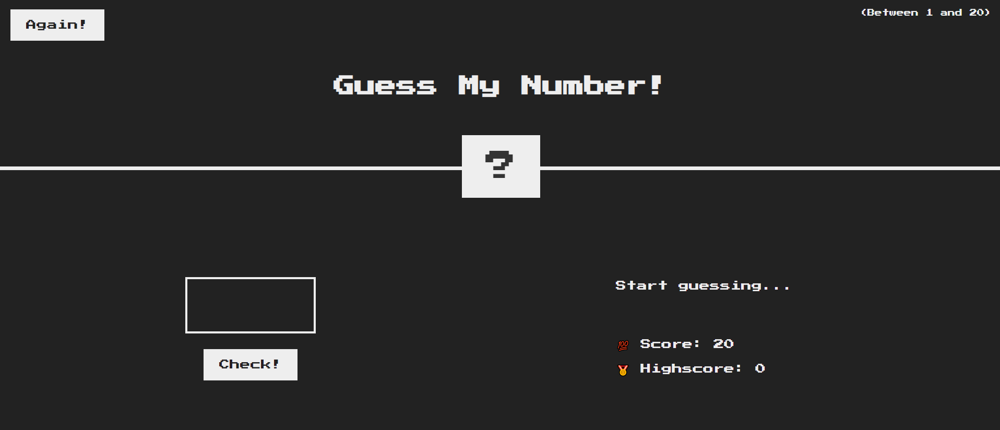
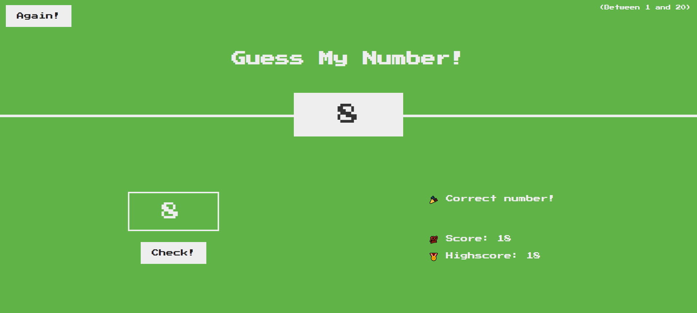

# Guess my number game

This is a fun game involving guessing a random number. The functionality is implemented with JavaScript.

This is part of a series of projects completed while taking Jonas Schmedtman's JavaScript course on Udemy (https://www.udemy.com/course/the-complete-javascript-course/)

The HTML and CSS codes are from Jonas, but the JavaScript code was developed by me during the course of this project.

The start of the game:



With each guess, a prompt tells you whether the guess is higher or lower than the secret number. Once you guess the right number, the game ends:



Steps to run this below:

1. Git clone the repository to your local machine.

```
git clone git@github.com:anandjebakumar/guess-my-number.git
```

2. Install node.js from http://nodejs.org

3. Install live-server

```
npm install live-server
```

4. Run live-server

```
live-server
```

Contact Anand Jebakumar (anandjsamuel@gmail.com) for questions or comments.
